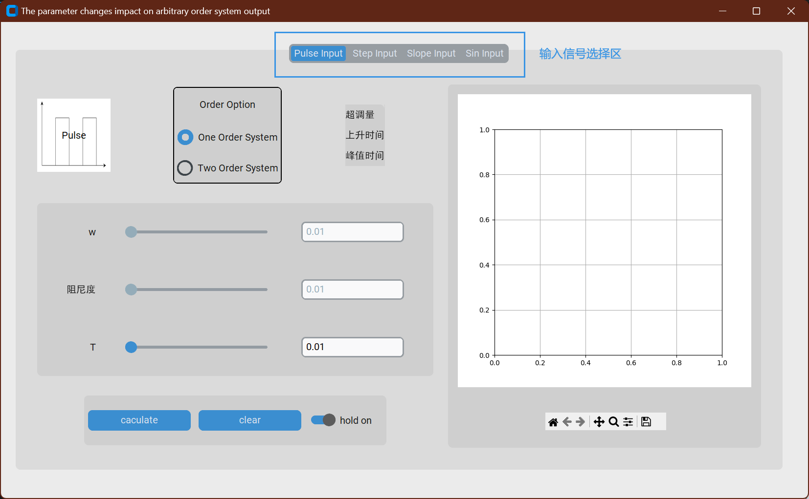
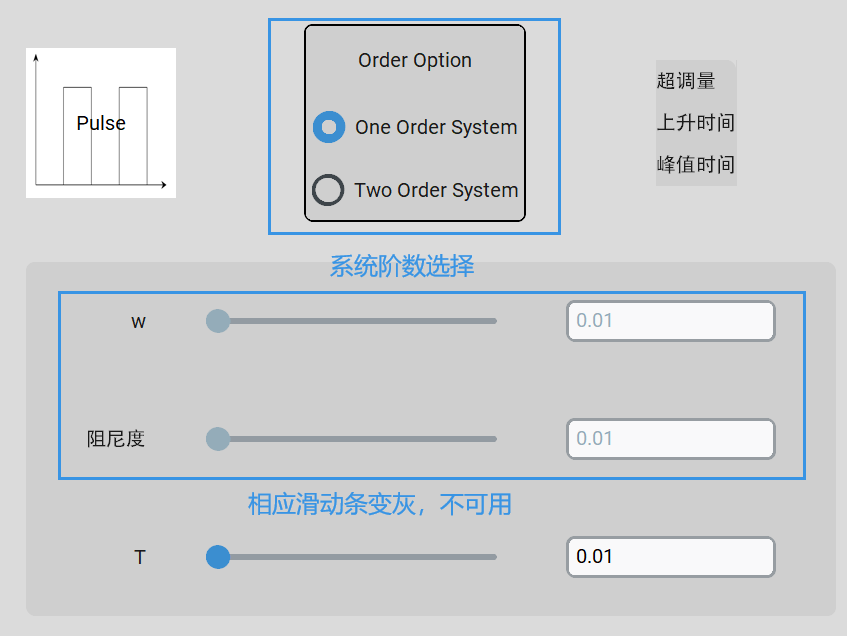
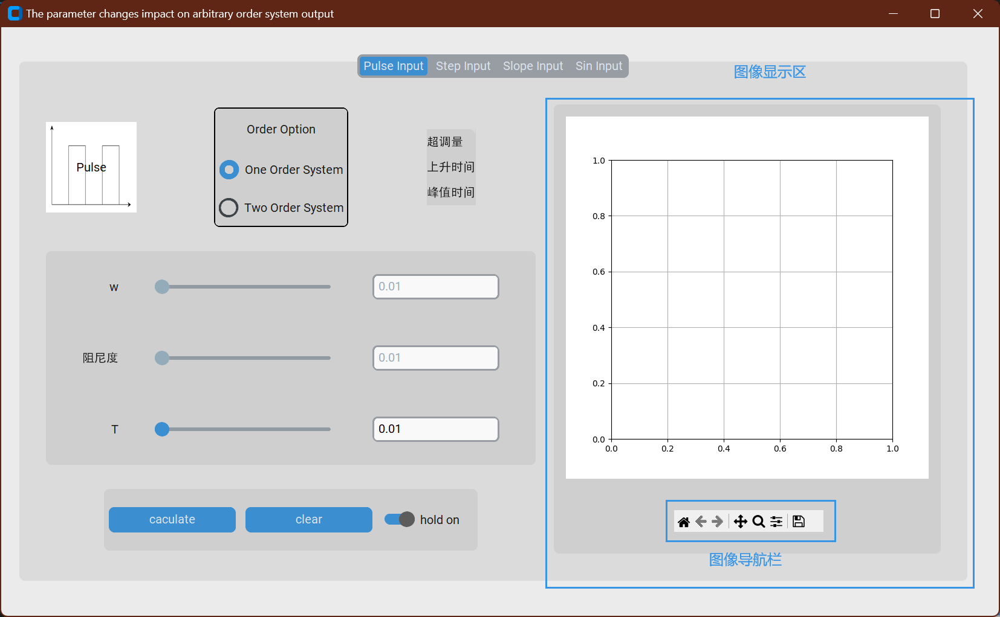
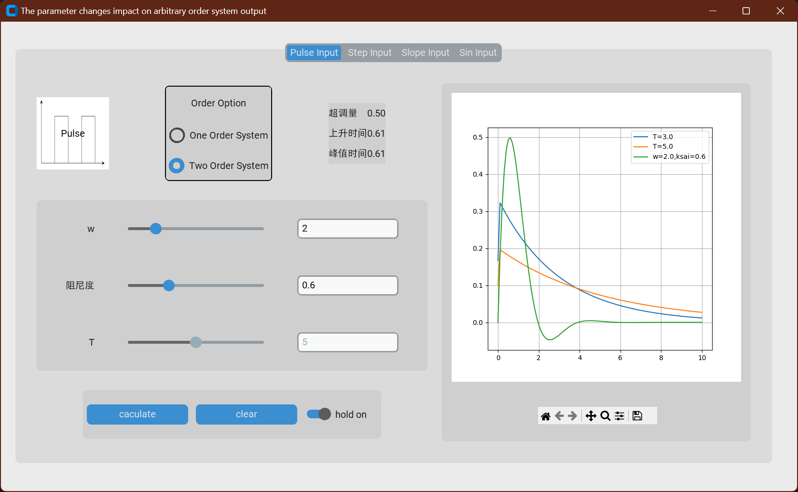
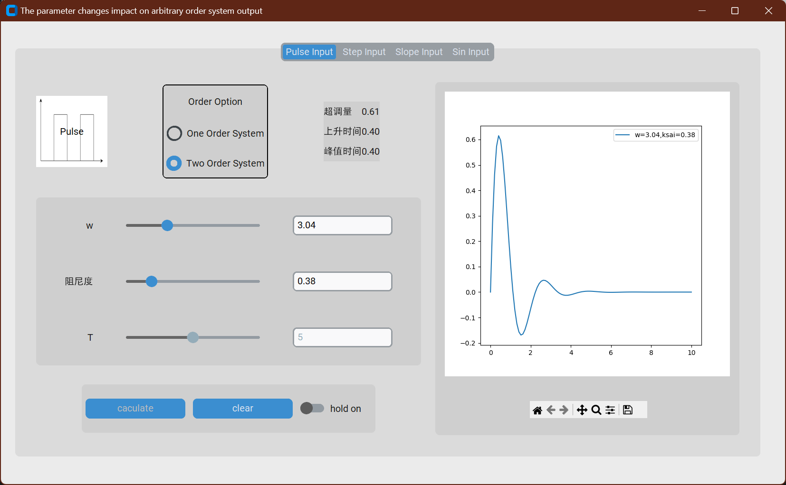

# Control Engneering Work with Python

典型信号输入下任意阶系统响应仿真

利用Python customtkinter库，设计APPdesign人机界面，能直观显示脉冲、阶跃、斜坡及不同频率正弦信号作用下，一二阶系统的输出响应，得出各阶系统参数变化对系统输出的影响规律，并显示系统的快速性及准确性指标。

## run

```sh
git clone https://github.com/dream-oyh/Control_Engneering_Twice_Work_Python.git
cd Control_Engneering_Twice_Work_Python
poetry install
poetry run python main.py
```

make sure your PC has configured poetry and tkinter, an example for archlinux user:

```sh
sudo pacman -S python-poetry tk
```

# Usage 

## 界面介绍

在本APP顶部，用户可依次选择“Pulse Input（脉冲输入）”“Step Input（阶跃输入）”“Slope Input（斜坡输入）”“Sin Input（正弦输入）”，确定输入信号类型，同时页面左上角的图像实时反映了选择的输入模式，并显示了输入函数的图像

`注：本系统所示输入均为单位输入，并没有考虑对系统输入的振幅进行调整`



Order Option选择框中可以选择系统的阶数，本APP提供了一阶系统（“One Order System"）与二阶系统（“Two Order System”）两种系统阶数，在选择阶数后，下方相应的滑动条也会变灰，显示为不可用状态



选择框右侧可实时显示反映该系统准确性与快速性的状态量，本APP提供了“超调量”“上升时间”与“峰值时间”的计算

下方滑动条与三个按钮可对右侧曲线图像进行操作，操作方法见“系统使用”部分，此处不再赘述

右侧曲线图像可以比较不同参数的输出图像或实时显示响应曲线，取决于“hold on”按钮的状态，下方的导航栏可以对图像进行一定的移动和变换



## 系统使用

本系统设计了两个功能模式：

1. 静态比较模式：固定不同参数的响应曲线在右侧图像中，以直观地比较不同参数对响应曲线的影响；

2. 动态变化模式：跟随滑动条变化实时显示响应曲线的动态变化过程，能够更好地展示在参数变化过程中曲线的动态变化。

界面通过hold on 按钮状态，切换以上两种模式。

当hold on按钮状态显示高亮时，此时为静态比较模式，该状态下“caculate”按钮显示为可用，移动滑动条后需要点击“caculate”按钮才会在右侧图像中显示响应曲线，并且图例中会显示本次计算的系统参数。



上图展示了在静态比较模式下，T=3，T=5两个一阶系统的响应曲线和w=2.0，阻尼度（图中用“ksai”表示）=0.6时，三种状态的响应曲线图比较

当hold on按钮状态显示关闭时，此时为动态变化模式，该状态下“caculate”按钮显示为不可用，移动滑动条后会实时展示随着滑动条变化响应曲线的形状变化，同时也会在图例中更新对应参数。

在一阶系统中，随着T的变化，状态响应曲线会实时改变；

二阶系统中，可以分别调整w和阻尼度，来分别研究固有频率与阻尼度对响应曲线的影响。



`注：滑动条右侧的输入框内，既可以实时反映滑动条数值，也可以手动输入数据，使滑动条自动调整到相应数值`

# 鸣谢

感谢绝对值_x对本项目的倾囊相授，耐心指点，没有他的帮忙我不可能一个人完成对我而言如此有挑战性的项目，[ref](https://github.com/lxl66566)这里是他的github主页，感兴趣的朋友可以点进去看一看~